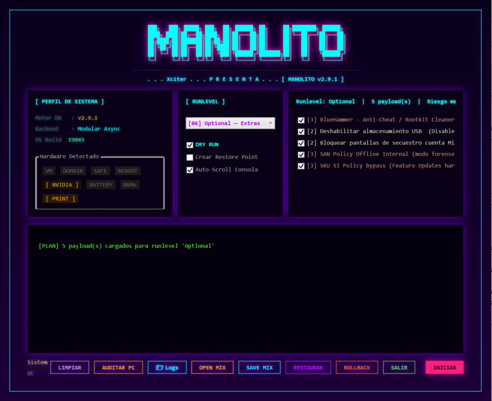
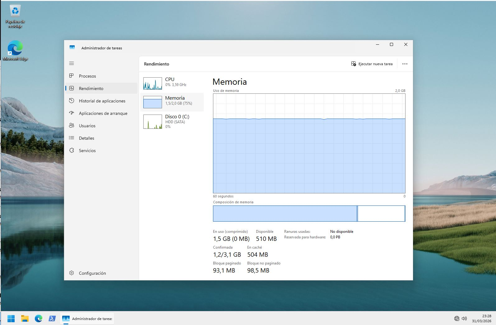

```
███╗   ███╗ █████╗ ███╗  ██╗ ██████╗ ██╗     ██╗████████╗ ██████╗ 
████╗ ████║██╔══██╗████╗ ██║██╔═══██╗██║     ██║╚══██╔══╝██╔═══██╗
██╔████╔██║███████║██╔██╗██║██║   ██║██║     ██║   ██║   ██║   ██║
██║╚██╔╝██║██╔══██║██║╚████║██║   ██║██║     ██║   ██║   ██║   ██║
██║ ╚═╝ ██║██║  ██║██║ ╚███║╚██████╔╝███████╗██║   ██║   ╚██████╔╝
╚═╝     ╚═╝╚═╝  ╚═╝╚═╝  ╚══╝ ╚═════╝ ╚══════╝╚═╝   ╚═╝    ╚═════╝ 
──────────────────────────────────────────────────────────────────────
   . . . Xciter . . . P R E S E N T S . . .  [ MANOLITO v2.9.1 ]

Target OS  : Windows 11 (Build 22000 - 26200+)
Framework  : PowerShell 5.1 (WPF Async · Runspaces · Dynamic Core)
Payload    : Dynamic Core Engine (WAD Architecture + Modular Async)
Protection : MS Telemetry, Cloud Identity, KMS Hunter, Bloatware
──────────────────────────────────────────────────────────────────────
```

```text
//--[ I N F O ]------------------------------------------------------\

Manolito ha evolucionado de un script de limpieza a un **Framework de
Aprovisionamiento totalmente Declarativo** diseñado bajo Zero Trust.

Esta versión 2.9.1 introduce el **Dynamic Core Engine**: un motor
completamente reescrito que separa ejecución, validación y estado en
capas independientes, con detección de hardware en tiempo real,
rollback milimétrico por sesión y una UI asíncrona que no se congela
aunque le metas 43 payloads seguidos.
Han sido muchas noches sin dormir, espero que os guste tanto como a mi.

//--[ M I L E S T O N E : W I N 1 1   L I G H T S P E E D ]----------\

He pulverizado los requisitos mínimos oficiales de Microsoft (4GB RAM).
Manolito Engine permite ejecutar Windows 11 de forma estable y ágil
con recursos drásticamente reducidos:

- **RAM Challenge**: Operatividad sobre máquinas con solo **2.0 GB de RAM**.
- **Consumo Base**: Reducción del uso de memoria hasta los **1.4 GB**.
- **CPU Idle**: Uso de procesador estabilizado entre el **0% y el 7%**.
- **Matrix Bug**: La purga es tan profunda que el sistema reporta **0.0 PB**
  de reserva para hardware.
```

```text
//--[ C O R E   A R C H I T E C T U R E ]----------------------------\

```
[!] Dynamic Core Engine (v2.9): Motor completamente reescrito.
    Ejecución, validación y estado en capas independientes.
    El WAD (Where's All the Data?) define payloads,
    runlevels y esquema desde manolito.json. Nada de acoplamiento
    entre lógica y configuración.

[!] Zero-Lag WPF UI: Interfaz asíncrona sobre Runspaces nativos
    y ConcurrentQueue con batch polling limitado. Las tareas
    corren en hilos secundarios. 43 payloads consecutivos sin
    bloqueo visual ni "No responde".

[!] VM-Aware Hardware Detection: El motor detecta en tiempo real
    si corre sobre VirtualBox, VMware, Hyper-V o QEMU mediante
    triple fallback (Win32_ComputerSystem → BIOS manufacturer →
    ACPI registry). Los payloads incompatibles se bloquean
    automáticamente antes de ejecutar.

[!] Rollback Stack por Sesión: Cada payload vuelca su estado
    previo en un stack antes de modificar el sistema. La
    reversión es granular, ordenada y sin dependencias externas.

[!] Auditoría Integrada: El motor genera un informe técnico del
    sistema (NVMe driver, MSI mode, KBs de riesgo, HAGS, VSS)
    y lo exporta a HTML firmado con timestamp.
```

//--[ R U N L E V E L S ]--------------------------------------------\

- 🟢 **[LITE]** — Elimina bloatware esencial y telemetría básica. El punto de entrada.
- 🔵 **[DEV-EDU]** — Optimiza redes, elimina publicidad y limpia restos de activadores KMS.
- 🔴 **[DEEP]** — Sintonía fina de latencia (Input Lag), activación MSI en GPU/NVMe,
  desactivación de VBS, limpieza WinSxS y hardening completo del sistema.
- 🟣 **[ROLLBACK]** — Reversión granular al estado previo. Stack de sesión, sin manifests externos.
- 🟠 **[OPTIONAL]** — Payloads de riesgo elevado o configuración específica de entorno.
  Requieren confirmación explícita del usuario antes de ejecutar.

> Los runlevels son acumulativos por diseño: DEEP incluye todo lo de LITE y DEV-EDU.
> ROLLBACK solo revierte lo que la sesión actual tocó.

//--[ U S A G E ]----------------------------------------------------\

Requiere `manolito.ps1` y `manolito.json` en el mismo directorio.
Se requieren **privilegios de Administrador**.

```powershell
# Lanzamiento con bypass de política de ejecución:
powershell.exe -ExecutionPolicy Bypass -File .\manolito.ps1
```

O, si no tienes ni idea, simplemente haz doble clic en el `.bat`.

> **DRY RUN recomendado antes de DEEP.** Actívalo en la UI antes de lanzar
> para auditar el plan completo sin modificar el sistema.

//--[ W H A T ' S   N E W   i n   2 . 9 . 1 ]----------------------\

| Área | v2.8.1 | v2.9.1 |
|---|---|---|
| Motor | Data-Driven estático | Dynamic Core Engine |
| Backend | Síncrono | Modular Async (Runspace pool) |
| Detección VM | Básica (Win32_ComputerSystem) | Triple fallback + ACPI registry |
| Rollback | Manifest externo (.json) | Stack de sesión en memoria |
| UI polling | Sin límite de batch | Batch 30 msgs/tick, 80ms interval |
| Timeout | 600s fijo | Dinámico según runlevel y hardware |
| Auditoría | Manual | Integrada, exportable a HTML |

//--[ S U P P O R T & D O N A T I O N S ]---------------------------\

Manolito es un proyecto desarrollado de forma independiente con cientos
de horas de ingeniería inversa, pruebas en laboratorio y depuración.

Si este motor te ha ayudado a rascar esos FPS extra en tu setup, ha
salvado tu viejo portátil o te ha ahorrado horas de configuración tras
un formateo, considera invitar al autor a un café (o a una bebida
energética...):

- [☕] Ko-fi: https://ko-fi.com/mhg778
- [💸] PayPal: https://paypal.me/mhg778

Cualquier aporte ayuda a mantener el proyecto vivo, pagar los servidores
de pruebas y seguir investigando las entrañas de Windows. ¡Gracias!

//--[ L E G A L   &   L I C E N S E ]--------------------------------\

Manolito Engine es software libre bajo licencia **GNU GPLv3** para uso
personal y educativo.

**AVISO PARA EMPRESAS Y MSP:** El uso en entornos corporativos o para
soporte lucrativo requiere una **Licencia Comercial** para eximirse de
las obligaciones Copyleft de la GPLv3. Contactar con el autor para
integraciones Enterprise.

```
──────────────────────────────────────────────────────────────────────
[ EOF ] - Stay secure. Stay light. Stay offline.
```
